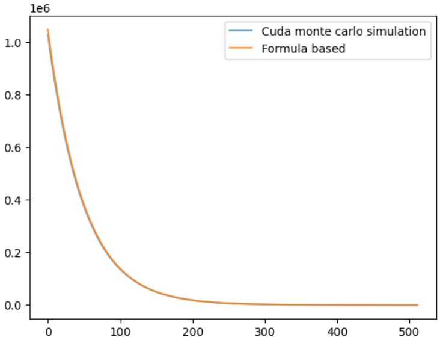
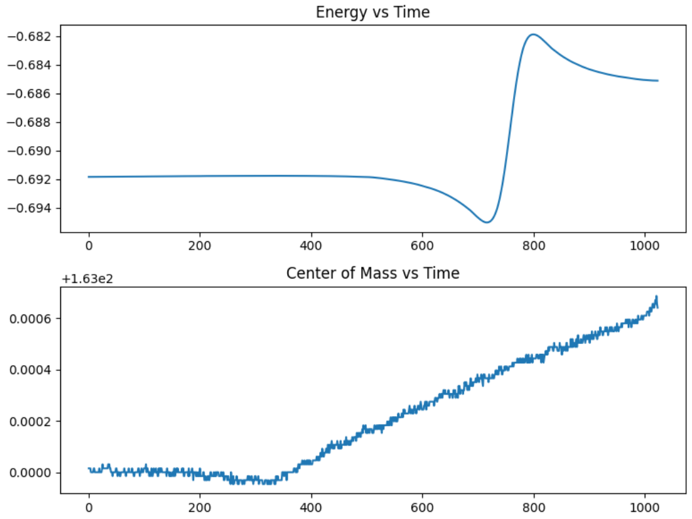

# CUDA Projects

A set of CUDA C programs written while learning GPU programming from scratch. The projects go from basic memory operations up to physics simulations, each one building on what came before.

### A few things that show up across all of these:
* **Tiling** -- large datasets are broken into smaller tiles that fit in shared memory, cutting down on slow global memory reads significantly.
* **Coalesced memory access** -- threads in a warp read or write adjacent memory addresses. It sounds like a small detail, but getting this wrong destroys memory bandwidth.
* **Thread and block layout** -- block and grid dimensions are chosen to fit the shape of the problem, not just picked arbitrarily.
* **Handling shared state** -- `atomicAdd`, block-level parallel reduction, and `__syncthreads()` appear where multiple threads would otherwise stomp on each other.

---

## Projects

### `copy_mat.cu`
Copies a 1024x1024 matrix entirely within the GPU. The matrix is also initialized in parallel on the device using a `__device__` function, so no host-to-device transfer is needed for the input. Block size is 32x8, with each thread looping 4 times to cover its tile. Mostly a first exercise in mapping thread coordinates to memory indices correctly.

### `transpose.cu`
Transposes a 128x128 float matrix. The problem with a naive transpose is that you cannot have coalesced reads and coalesced writes at the same time. The fix is shared memory: the tile is loaded from global memory with coalesced reads, held in the block's shared memory, then read back column-wise (which is fast from shared memory) and written to the output in a coalesced pattern. The shared memory tile is sized 32x33 instead of 32x32 specifically to avoid bank conflicts.

### `tiled_matmul.cu`
Tiled matrix multiplication. Each block is responsible for one output tile. Tiles from A and B are loaded into shared memory in steps, partial products are accumulated, and the tiles advance until the full dot product is done. The reduction in global memory traffic compared to the naive approach is the whole point.

### `radioactivity1.cu`
Simulates the decay of about one million atoms over 512 time steps, each atom having a fixed probability of decaying per step. Each thread manages 32 atoms packed into a single `uint32_t` bit field, using cuRAND for per-atom random numbers and `__popc` (hardware popcount) to count surviving atoms in one instruction. Alive counts are accumulated per time step using block-level parallel reduction with a stride loop before a single `atomicAdd`, keeping serialization low. Results are written to a CSV file.

### `simple_pendulum.cu`
Simulates 8192 independent pendulums in parallel, each starting with different initial angle and length. Uses 4th-order Runge-Kutta (RK4) for accurate numerical integration across 512 time steps. Register pressure is a real constraint here since each thread carries its own simulation state, so variable lifetimes are managed carefully to stay within the hardware limit. Pendulum lengths live in constant memory. After the simulation, a separate transpose kernel rearranges the output so data is laid out per-pendulum rather than per-time-step.

### `Ngravity_v2.cu`
2D N-body gravity simulation of 1024 particles over 1024 time steps. All pairwise gravitational forces are computed using a tiled shared memory loop, where each block loads a batch of particle positions into shared memory before computing forces from that subset. Position and velocity updates are handled with the Velocity Verlet integrator across three kernels, which keeps the simulation numerically stable over long runs. Global quantities like total energy and center of mass are accumulated with `atomicAdd`. The most involved project in the repo.

---
*Written in CUDA C. All projects target general NVIDIA GPU hardware.*
